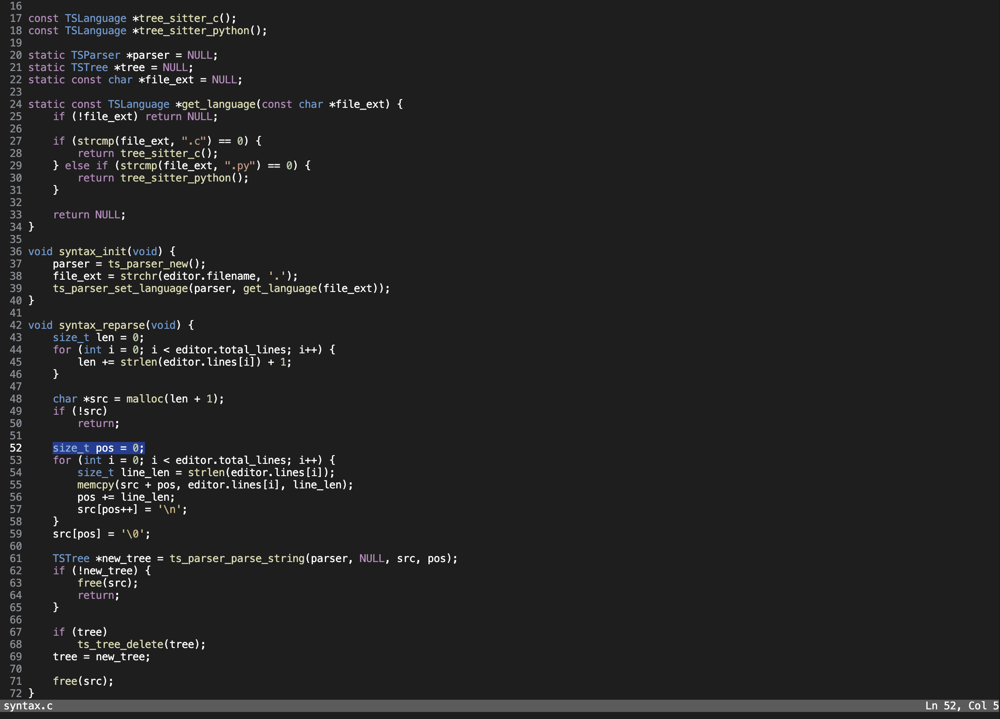

# Tomo


**Tomo** is a terminal-based code editor focused on simplicity and working out of the box without any configuration. Inspired by the lightweight nature of Helix and the intuitiveness of VS Code, it uses `ncurses` for terminal UI and `tree-sitter` for fast syntax highlighting.

Image of Tomo code editor in action:



## Features

- Go to line (<kbd>Ctrl-g</kbd>)  
- Copy, paste, cut (<kbd>Ctrl-c</kbd>, <kbd>Ctrl-v</kbd>, <kbd>Ctrl-x</kbd>)  
- Syntax highlighting (basic support for Python and C)  
- Smart indentation

## Installation

```sh
git clone https://github.com/Dasdron15/Tomo.git
cd <path/to/tomo>
make
sudo make install
```

`make` builds the editor and `sudo make install` installs it system-wide

## Usage 

```sh
tomo <path/to/file>
```

Currently, folder/project opening is not supported but planned for future releases.

## Planned features

- Undo/Redo
- Folder/project support
- Mouse support
- Syntax highlighting for more languages
- Auto-completion
- Theme support
- Vim mode

## Contribution

Contributions, bug reports and feature requests are welcome!
